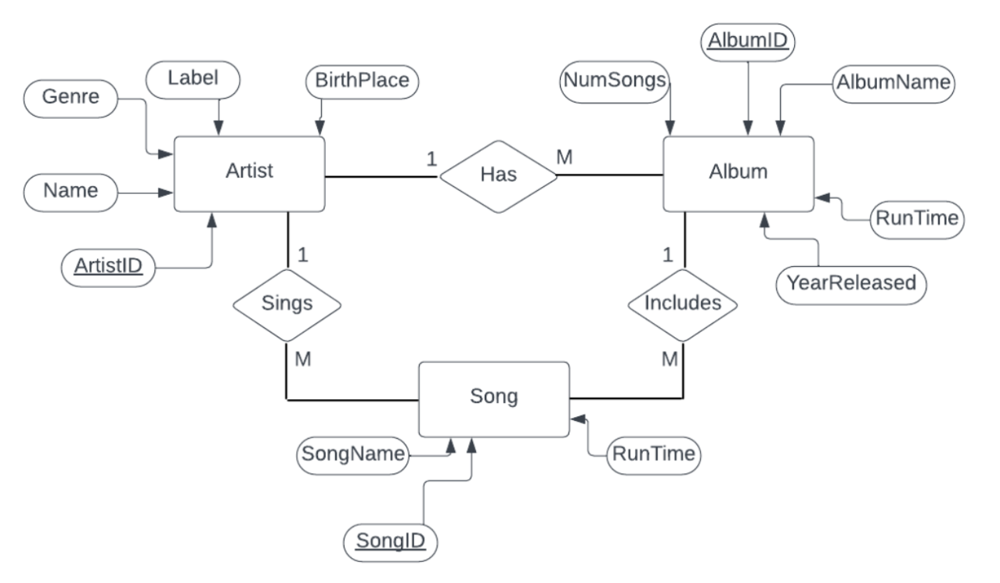

## Music Database
# Final Project for CS2990: Intro to Database Systems
Professor: Jackie Horton
Team: Lily Bonds, Adalia Williams

## Description: 
Our project is a music database with three tables: artists, albums, and songs. We collected and created the databases ourselves, researching some of our favorite artists. The application allows users to add, remove, or modify any entry in our data. For all of the numerical columns, the user can calculate the mean, median, minimum, maximum, and standard deviation of the data. The user can form queries for multiple columns in each table using WHERE in sqlite, such as limiting song length and searching using a word for an album or song. The user can also utilize JOIN, with searching for a year of a release, or searching for songs or albums by an artist. Using the visualization menu, the user can visualize the runtimes of albums for all artists, runtime of songs in any album, or the years of all albums.

## E-R Diagram

